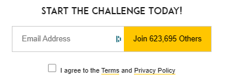
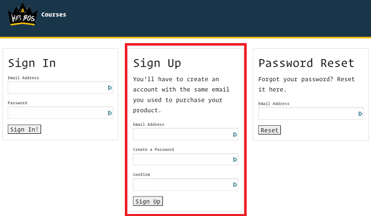
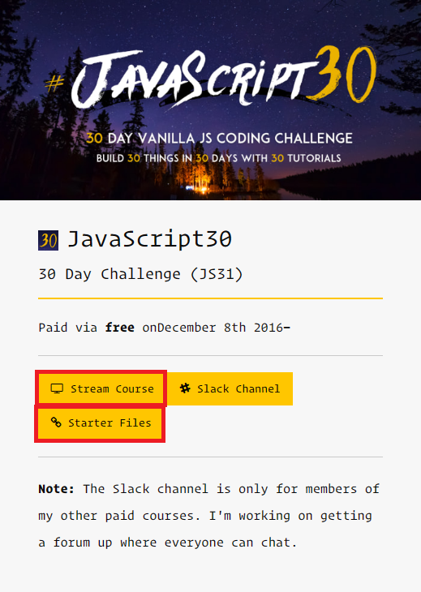

# JavaScript30.com

[JavaScript30.com](https://javascript30.com) est un site proposant une trentaine de tutoriels vidéos gratuits pour apprendre le JavaScript.

Chaque tutoriel est accompagné d'un **code source** et d'un **lien vers un exemple en ligne**.

Commencez par entrer votre adresse email afin de pouvoir vous créer un compte et accéder aux tutoriels :

  

Rendez-vous ensuite sur la [page de création de compte](https://courses.wesbos.com/account/signin) et créez votre compte avec la même adresse email :

  

Arrivés sur votre panel, vous avez accès ... :
- aux [**vidéos des tutoriels**](https://courses.wesbos.com/account/access/5849c5ec8dab401bac1a40b5)
- aux [**starter files**](https://github.com/wesbos/JavaScript30) (fichiers de départ)

  

## Les tutoriels

### 01 - JavaScript Drum Kit

Créez un clavier virtuel qui joue des sons de batterie.

### 02 - JS and CSS Clock

Créez une horloge analogique avec les aiguilles qui tournent en fonction de l'heure.

### 03 - CSS Variables

Créez un formulaire permettant de modifier les propriétés CSS d'une image.

### 04 - Array Cardio Day 1

Manipulez des tableaux avec les méthodes `filter`, `map`, `sort` et `reduce`.

### 05 - Flex Panel Gallery

Créez une galerie d'images avec des effets de transition.

### 06 - Type Ahead

Créez un formulaire de recherche avec autocomplétion.

### 07 - Array Cardio Day 2

Manipulez des tableaux avec les méthodes `some`, `every`, `find` et `findIndex`.

### 08 - Fun with HTML5 Canvas

Créez un canvas sur lequel on peut dessiner avec la souris.

### 09 - Dev Tools Domination

Découvrez les outils de développement de Chrome.

### 10 - Hold Shift and Check Checkboxes

Créez une liste de cases à cocher avec la possibilité de cocher plusieurs cases en même temps en maintenant la touche Shift.

### 11 - Custom Video Player

Créez un lecteur vidéo personnalisé avec des boutons de contrôle.

### 12 - Key Sequence Detection

Créez un détecteur de séquence de touches.

### 13 - Slide in on Scroll

Créez des animations au scroll de la page.

### 14 - JavaScript References VS Copying

Découvrez les différences entre les références et les copies d'objets et de tableaux.

### 15 - LocalStorage

Apprenez à utiliser le localStorage pour stocker des données dans le navigateur.

### 16 - Mouse Move Shadow

Créez un effet d'ombre qui suit le mouvement de la souris.

### 17 - Sort Without Articles

Triez une liste d'éléments en ignorant les articles.

### 18 - Adding Up Times with Reduce

Additionnez des durées au format `hh:mm:ss` avec la méthode `reduce`.

### 19 - Webcam Fun

Créez des effets sur une webcam.

### 20 - Speech Detection

Créez un détecteur de voix.

### 21 - Geolocation

Affichez une carte avec la position de l'utilisateur.

### 22 - Follow Along Link Highlighter

Créez un effet de surlignage sur les liens.

### 23 - Speech Synthesis

Créez un synthétiseur vocal.

### 24 - Sticky Nav

Créez un menu qui reste collé en haut de la page au scroll.

### 25 - Event Capture, Propagation, Bubbling and Once

Découvrez les différents types d'événements et leur propagation.

### 26 - Stripe Follow Along Nav

Créez un menu qui s'ouvre au survol de la souris.

### 27 - Click and Drag

Créez un effet de glissement au clic et au déplacement de la souris.

### 28 - Video Speed Controller

Créez un contrôleur de vitesse pour les vidéos.

### 29 - Countdown Timer

Créez un minuteur.

### 30 - Whack A Mole

Créez un jeu de tape-la-taupe.

